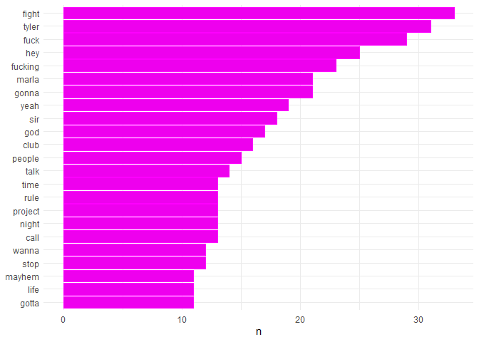
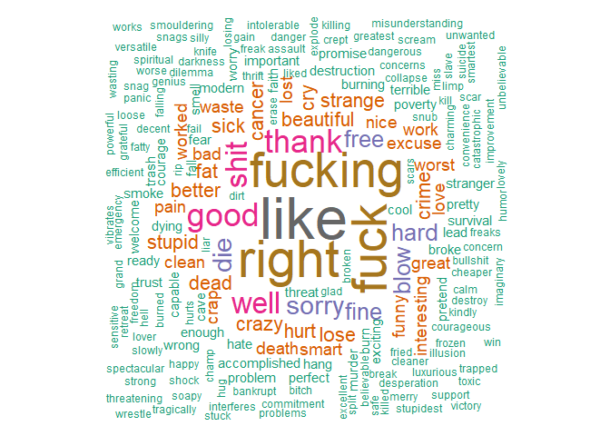
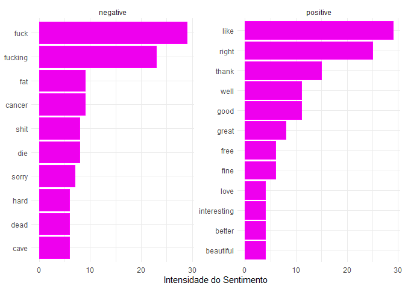
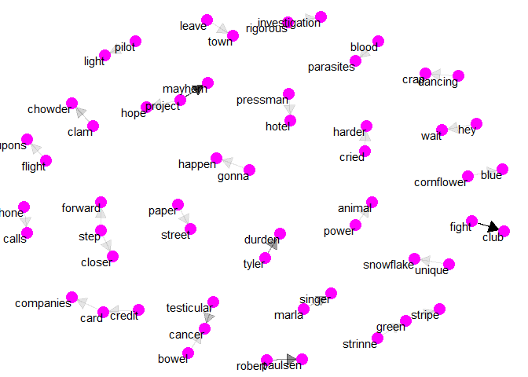

Análise textual - Clube da luta
================
Evandro da Silva Magalhães Jr
Julho de 2020

# Resumo

Neste projeto tem como objetivo fazer uma análise textual das falas do
filme Clube da Luta. Iniciando no estudo da análise de sentimentos,
usamos como base a análise da polaridade entre as palavras, que é a
verificação da intensidade da positividade, neutralidade e negatividade
na evolução da leitura de um texto. A análise de sentimentos pode ser
utilizadas em diversos tipos de textos, desde coleta de textos de sites
e redes sociais por raspagem de dados, até textos de livros em fomrato
digital.

Nesse projeto a análise será feita com base nas legendas do filme clube
da luta, com objetivo de analisar a polaridade das palavras e fazer uma
análise textual.

# Introdução

O filme Clube da Luta é um filme dirigido por David Fincher e foi
lançado em 1999 e foi baseado no livro também nomeado de Clube da Luta
que foi publicado em 1996 e escrito por Chuck Palahniuk. O filme é
considerado por muito um dos melhores filmes já feitos tratando de temas
políticos, econômicos, sociais e saúde mental.

Neste projeto não será feita análise sobre o conteúdo do filme. Porém
aqui tem um [link](https://www.youtube.com/watch?v=OLt0s4lhf88) de um
review do livro feito pela Isabella Lubrano do canal Ler Antes de
Morrer. É um excelente conteúdo e mostra a visão de uma mulher a
respeito dessa obra.

# Resultados

Frequência palavras

No gráfico abaixo podemos ver as palavras mais frequentes no texto.

<!-- -->

Nuvem de palavras

Contruindo a nuvem de palavras é possível observar os termos mais
frequentes de uma forma diferente, assim conseguimos ver o grande número
de palavras negativas e xingamentos que existem no texto.

Além disso temos algumas expressões em destaque como: depression,
darkness, suicide e outras palavras que levam a acreditar que durante
oenrredo do filme serão abordados assuntos relacionados ao estado mental
da personagem.

<!-- -->

Polaridade das palavras

O gráfico abaixo mostra a a polaridade das palavras dividida em positivo
e negativo.

<!-- -->

Rede de bi-grams

Na imagem abaixo podemos ver a releção entre palavras feitas em bi -
gramas que e feita a partir da correlação entre as palavras dentro dos
textos. Assim conseguimos ver quais palavras tem relação entre si e
tirar algumas conclusões a respeito do texto.

<!-- -->

Assim mesmo sem ver o filme ou ler o texto, é possível a partir das
informações extraidas da analise textual entender sobre o enrredo da
história. Observando a imagem acima existe uma relação entre as palavras
*credit*, *card* e *companies*, que é um ponto impoprtante no enredo da
história. Além da forte relação entre as palavras *fight* e *club* que é
um dos pontos mais importantes da história e nomeia a obra.

# Referencial Bibliográfico

Csardi G, Nepusz T: The igraph software package for complex network
research, InterJournal, Complex Systems 1695. 2006. <http://igraph.org>.

David Robinson (2020). widyr: Widen, Process, then Re-Tidy Data. R
package version 0.1.3. <https://CRAN.R-project.org/package=widyr>.

Garrett Grolemund, Hadley Wickham (2011). Dates and Times Made Easy with
lubridate. Journal of Statistical Software, 40(3), 1-25. URL:
<http://www.jstatsoft.org/v40/i03/>.

Ian Fellows (2018). wordcloud: Word Clouds. R package version 2.6.
<https://CRAN.R-project.org/package=wordcloud>.

Ingo Feinerer and Kurt Hornik (2019). tm: Text Mining Package. R package
version 0.7-7. <https://CRAN.R-project.org/package=tm>.

Julia Silge and David Robinson(2017). Text Mining with R. Acesso em:
maio 2019, url: <https://www>. tidytextmining.com/index.html.

Silge J, Robinson D (2016). “tidytext: Text Mining and Analysis Using
Tidy Data Principles in R.” *JOSS*, *1*(3). doi: 10.21105/joss.00037
(URL: <https://doi.org/10.21105/joss.00037>), \<URL:
<http://dx.doi.org/10.21105/joss.00037>\>.

Thomas Lin Pedersen (2020). ggraph: An Implementation of Grammar of
Graphics for Graphs and Networks. R package version 2.0.3.
<https://CRAN.R-project.org/package=ggraph>.

Wickham et al., (2019). Welcome to the tidyverse. Journal of Open Source
Software, 4(43), 1686, <https://doi.org/10.21105/joss.01686>.
